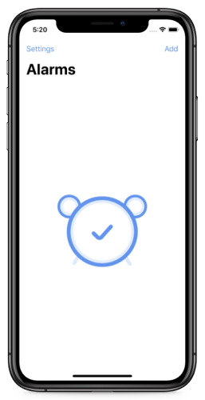
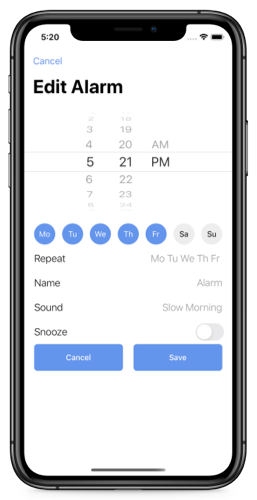
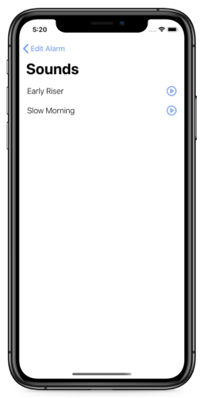
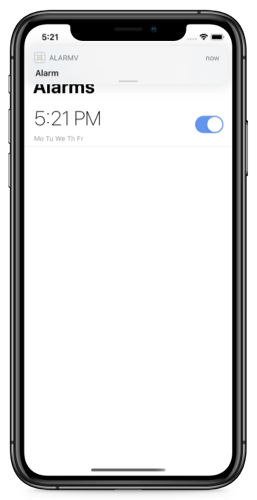
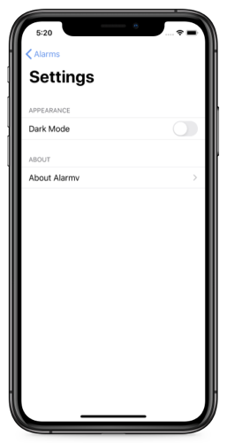
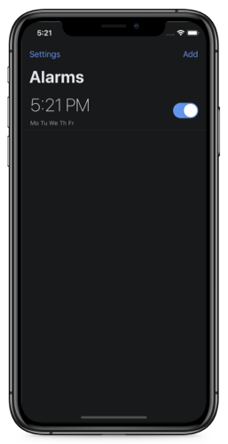
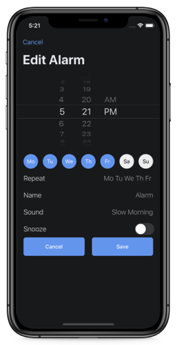
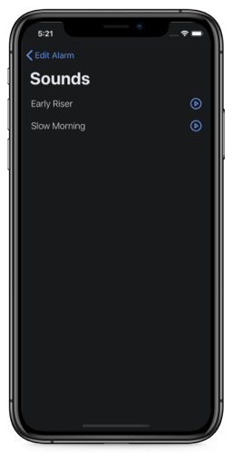

# iOS-Alarm
## Description
- Simple alarm application for ios. The alarm works like a notification using the UserNotifications.

## Features
- Set time, repeat days, name, sound, snooze for some notifications
- Delete notification
- Turn on/turn off notifications
- Support for light & dark mode
- Play sound

## Used
- MVC
- CoreData
- UserNotifications
- Fully programmatically UI
- AutoLayout
- UserDefaults
- AVAudioPlayer
- UIKit

## Screenshots
       